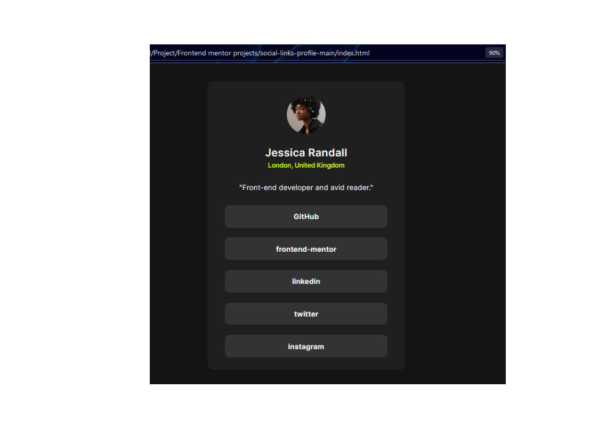

## Overview
Good project for Beginner .
### The challenge

Users should be able to:

- See hover and focus states for all interactive elements on the page

### Screenshot

### Links

- Solution URL: [Add solution URL here](https://your-solution-url.com)
- Live Site URL: [Add live site URL here](https://your-live-site-url.com)

## My process

### Built with

- Semantic HTML5 markup
- CSS custom properties
- Flexbox
- Mobile-first workflow

### What I learned

creating a social link profile, static website using html and css. learn how to work on anchor and div at a same time on hover.  

## Author

- Website - [Chandan Kumar Singh](https://www.your-site.com)
- Frontend Mentor - [@Indian-goku](https://www.frontendmentor.io/profile/Indian-goku)
- Twitter - [@singhchandan98](https://twitter.com/singhchandan98)

